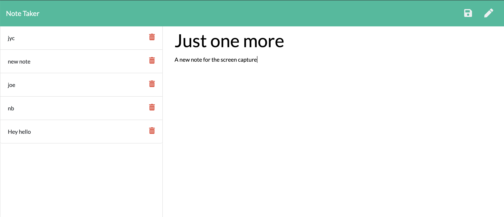

# Note Taker Starter Code

This application was designed by Joseph Cosgrove. It has a front end that uses user input to add to a back end database which populates the application. 

The front end was designed with:

- HTML
- CSS
- JavaScript
- Bootstrap

The back end was designed with: 

- Node.js
- Express.js

This application is deployed to Heroku at: https://note-taker-lps.herokuapp.com/

